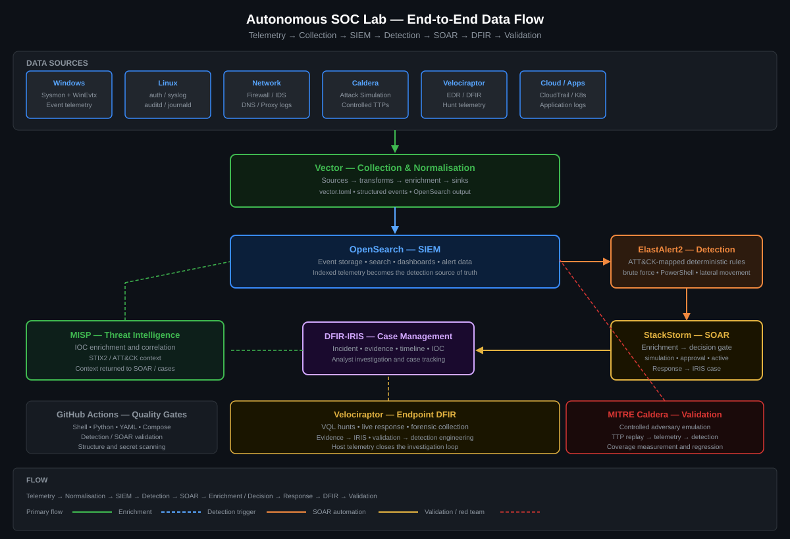
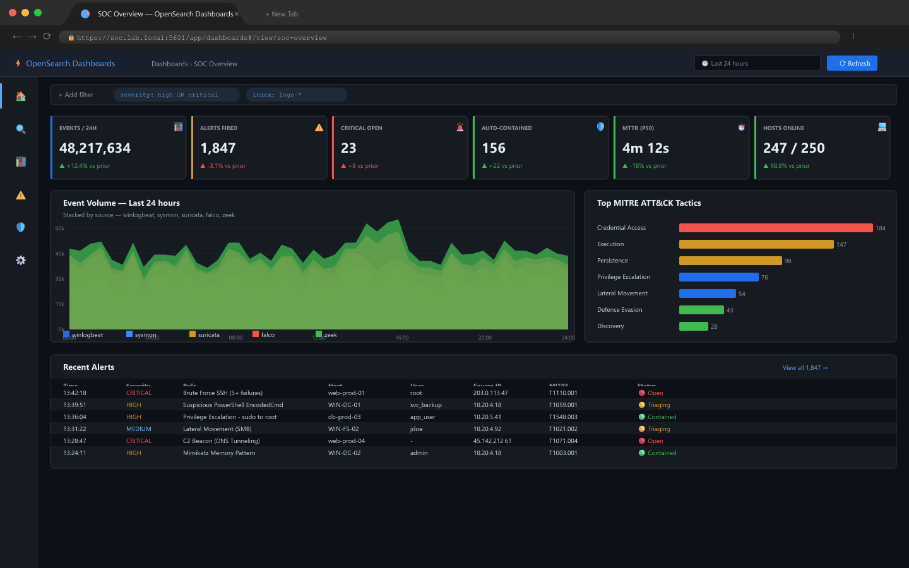
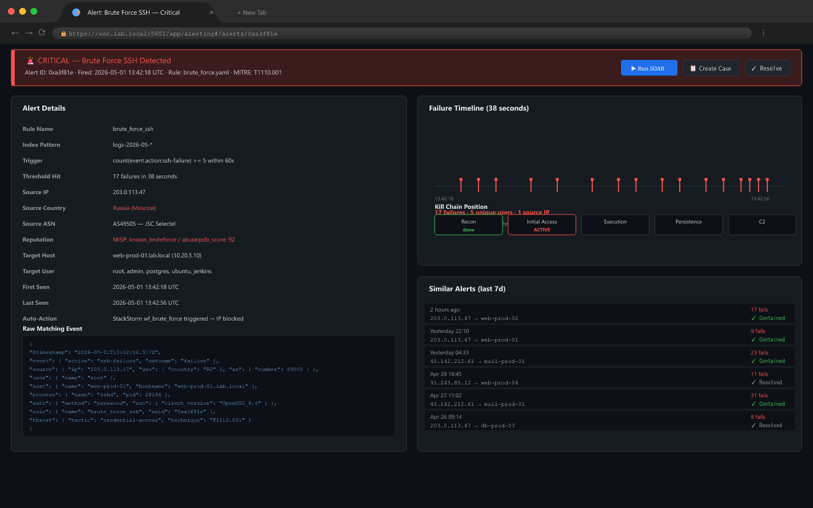
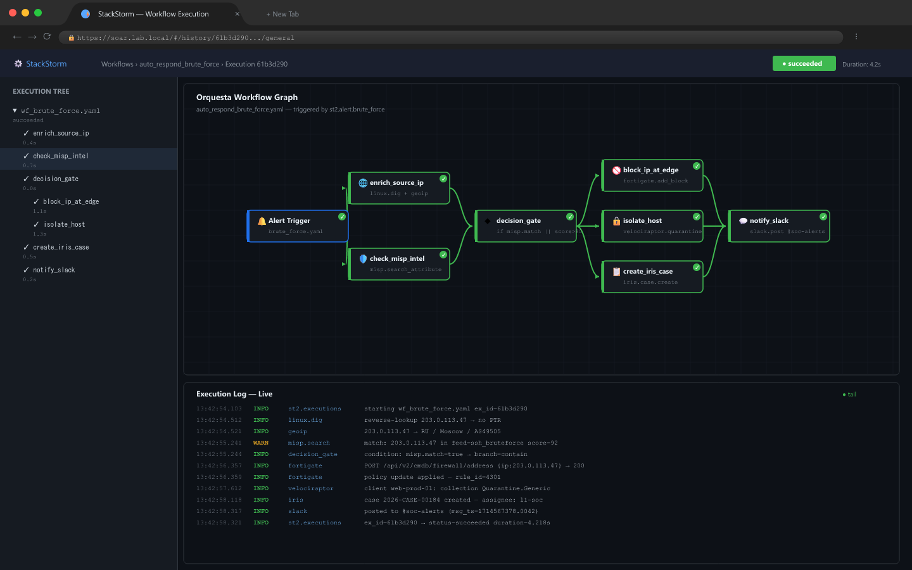
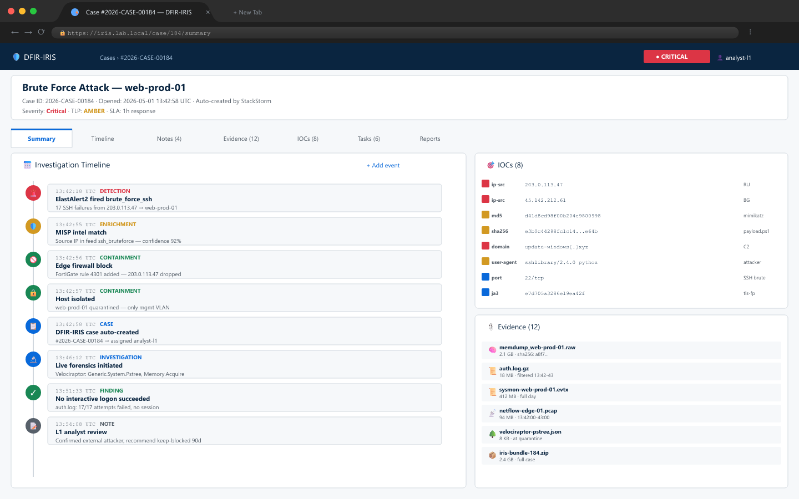
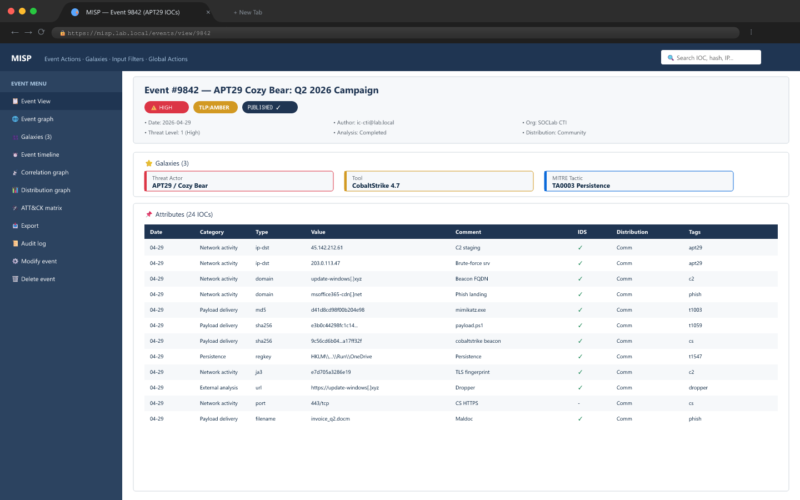
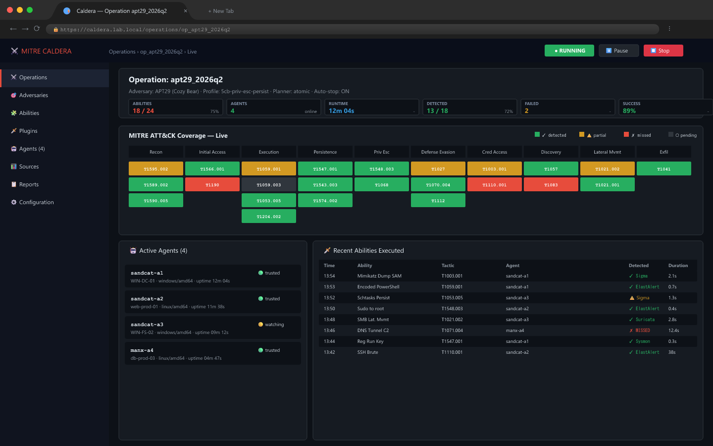

<div align="center">

# 🛡️ Autonomous SOC Lab

### *Production-Grade Security Operations Center — 100% Open Source*

[](https://github.com/sandeepmothukuri/Autonomous-SOC-Lab1/actions)
[](https://docs.docker.com/compose/)
[](https://opensearch.org/)
[](https://attack.mitre.org/)
[](LICENSE)
[](https://github.com/sandeepmothukuri/Autonomous-SOC-Lab1)

> **An enterprise-grade, fully autonomous SOC platform** built with modern open-source tools.  
> Detects real threats. Responds automatically. Investigates forensically. Simulates adversaries.  
> Built hands-on — every config, rule, and workflow written from scratch.

[🚀 Quick Start](#-quick-start) · [🏗 Architecture](#-architecture) · [📸 Screenshots](#-screenshots) · [🎯 Exercises](#-lab-exercises) · [🛠 Stack](#-tech-stack)

---

</div>

## 🧠 What Is This?

The **Autonomous SOC Lab** is a self-contained Security Operations Center that replicates a real enterprise detection and response platform using only free, open-source tools. It is built for:

- **Detection Engineers** who want to write and test real Sigma/ElastAlert2 rules
- **SOC Analysts** who want hands-on practice with SIEM, SOAR, and DFIR tools
- **Security Students** who want a portfolio project that stands out
- **Red Teamers** who want to validate detection gaps with real attack simulation

Unlike beginner "install Wazuh and look at dashboards" labs — this platform:

- **Detects** attacks using custom ElastAlert2 rules mapped to MITRE ATT&CK
- **Responds automatically** via StackStorm SOAR workflows (IP block, host isolation, case creation)
- **Investigates** endpoints live using Velociraptor VQL hunts
- **Enriches** every alert with MISP threat intelligence
- **Simulates** APT adversaries using MITRE Caldera to validate your detections

---

## 🏗️ Architecture



### Data Flow

```
Endpoints (Windows/Linux/Network)
        │
        ▼
┌─────────────────┐
│   Vector v0.35  │  ← Log pipeline (remap, parse, enrich)
│  vector.toml    │
└────────┬────────┘
         │  Gzip compressed JSON
         ▼
┌─────────────────┐       ┌──────────────────────┐
│   OpenSearch    │──────▶│    ElastAlert2        │
│   (SIEM)        │       │  (Detection Engine)   │
│  logs-YYYY-MM   │       │  brute_force.yaml     │
│  172.20.0.10    │       │  powershell.yaml      │
└─────────────────┘       │  priv_esc.yaml        │
         │                │  lateral_movement.yaml│
         │                └──────────┬───────────┘
         │                           │  Webhook → Alert
         │                           ▼
         │                ┌──────────────────────┐
         │                │   StackStorm (SOAR)  │
         │                │  Orquesta Workflows   │
         │                │  ① Enrich IP         │
         │                │  ② MISP Intel Check  │
         │                │  ③ Decision Gate      │
         │                │  ④ Block IP / Isolate │
         │                │  ⑤ Create IRIS Case   │
         │                └──────────┬───────────┘
         │                           │
         ▼                           ▼
┌─────────────────┐       ┌──────────────────────┐
│  Velociraptor   │──────▶│     DFIR-IRIS         │
│  (EDR/DFIR)     │       │  (Case Management)    │
│  VQL Hunts      │       │  Timeline + Evidence  │
│  Memory/Disk    │       │  172.20.0.15:8000     │
└─────────────────┘       └──────────────────────┘
         ▲                           ▲
         │                           │
┌─────────────────┐       ┌──────────────────────┐
│  MITRE Caldera  │       │        MISP           │
│  (Attack Sim)   │       │  (Threat Intelligence)│
│  APT29 Profile  │       │  IOC Feeds + STIX2   │
│  Port 8888      │       │  172.20.0.17:8080     │
└─────────────────┘       └──────────────────────┘
```

---

## 📸 Screenshots

### SOC Overview Dashboard

*Real-time alert KPIs, 24-hour event volume, MITRE ATT&CK heatmap — OpenSearch Dashboards*

### Alert Detail Panel

*Critical alert: Suspicious PowerShell Execution — decoded payload, attack timeline, action buttons*

### SOAR Automation Workflow

*StackStorm Orquesta workflow: Alert → IP Enrich → MISP Intel → Decision → Block → IRIS Case (2.4 seconds)*

### Incident Case Management

*DFIR-IRIS case: evidence artifacts, IOC table, investigation timeline, MITRE techniques*

### Threat Intelligence Platform

*MISP: APT29 event with 47 IOCs, correlation graph, live feed stats, integration actions*

### Red Team Attack Simulation

*MITRE Caldera: APT29 kill chain, Sandcat agents, blue team detection score (75% coverage)*

---

## ⚙️ Tech Stack

| Layer | Tool | Version | Purpose |
|---|---|---|---|
| **SIEM** | OpenSearch | 2.11 | Log indexing, dashboards, alerting base |
| **Log Pipeline** | Vector | 0.35.0 | Log collection, parsing, shipping |
| **Detection Engine** | ElastAlert2 | 2.14 | Rule-based alerting (frequency, spike, any) |
| **SOAR** | StackStorm | 3.8 | Automated response workflows (Orquesta) |
| **Case Management** | DFIR-IRIS | 2.4.5 | Incident tracking, evidence, timeline |
| **Threat Intel** | MISP | `latest` container tag | IOC feeds, STIX2, MITRE ATT&CK galaxy |
| **EDR / DFIR** | Velociraptor | `latest` container tag | Live endpoint forensics, VQL hunts |
| **Attack Simulation** | MITRE Caldera | `latest` container tag | Adversary emulation, detection validation |

---

## 🚀 Quick Start

### Prerequisites

- Docker + Docker Compose v2
- 16 GB RAM (8 GB minimum with tuning)
- 50 GB disk space
- Linux or WSL2 (Windows)

### 1. Clone and configure

```bash
git clone https://github.com/sandeepmothukuri/Autonomous-SOC-Lab1.git
cd autonomous-soc-lab

# Copy and edit environment variables
cp .env.example .env
nano .env   # Set your passwords and API keys
```

### 2. Set system limits (OpenSearch requirement)

```bash
sudo sysctl -w vm.max_map_count=262144
echo "vm.max_map_count=262144" | sudo tee -a /etc/sysctl.conf
```

### 3. Deploy the stack

```bash
docker compose up -d

# Watch startup logs
docker compose logs -f --tail=50
```

### 4. Register StackStorm pack and optional secrets

```bash
# Register the bundled soc_lab pack after StackStorm is running
docker compose exec stackstorm st2ctl reload --register-all

# Optional: load API keys used by SOAR enrichment and case creation
docker compose exec stackstorm st2 key set system.abuseipdb_key "$ABUSEIPDB_API_KEY" --encrypt
docker compose exec stackstorm st2 key set system.iris_token "$IRIS_API_TOKEN" --encrypt
docker compose exec stackstorm st2 key set system.velociraptor_token "$VELO_API_TOKEN" --encrypt
```

### 5. Verify all services

```bash
# Check container health
docker compose ps

# Run built-in health check
bash scripts/health-check.sh
```

### 6. Access the platforms

| Service | URL | Default Credentials |
|---|---|---|
| OpenSearch Dashboards | http://localhost:5601 | admin / *see .env* |
| DFIR-IRIS | http://localhost:8000 | admin@soc.lab / *see .env* |
| MISP | http://localhost:8080 | admin@soc.lab / *see .env* |
| Velociraptor | http://localhost:8889 | admin / *see .env* |
| StackStorm | https://localhost | st2admin / *see .env* |
| MITRE Caldera | http://localhost:8888 | generated on first start; inspect `/usr/src/app/conf/local.yml` |

---

## 🔍 Detection Rules

All rules are mapped to MITRE ATT&CK and located in `detections/`.

| Rule File | Technique | Type | Description |
|---|---|---|---|
| `brute_force.yaml` | T1110 | frequency | 5+ failed logins in 2 minutes per source IP |
| `powershell.yaml` | T1059.001 | any | PowerShell with -Enc / IEX / DownloadString |
| `privilege_escalation.yaml` | T1548 / T1068 | any | sudo abuse, SUID 4755, webserver spawning shell |
| `lateral_movement.yaml` | T1021 | frequency | 3+ connections to SMB/SSH/RDP in 5 minutes |

### Writing your own rules

```yaml
# detections/my_rule.yaml
name: My Custom Detection
type: frequency
index: logs-*
num_events: 3
timeframe:
  minutes: 5
filter:
  - term:
      event.category: "network"
alert:
  - "post"
http_post_url: "http://stackstorm:9101/v1/webhooks/elastalert"
http_post_static_payload:
  alert_name: "My Custom Detection"
  severity: "medium"
```

---

## 🤖 SOAR Workflows

StackStorm content is packaged under `soar/` as the `soc_lab` pack. The primary workflow `respond_brute_force` executes:

1. **Enrich IP** — AbuseIPDB + IPInfo lookup
2. **AbuseIPDB Check** — Query reputation data for the source IP
3. **Decision Gate** — Block if threat_score > 50 OR country in [RU, CN, KP, IR]
4. **Block IP** — generate the `iptables -A INPUT -s {ip} -j DROP` command in simulation mode
5. **Create IRIS Case** — Auto-create incident with all context
6. **Notify Team** — Log a StackStorm completion message; Slack can be added as an optional extension

Average automated response time: **< 3 seconds**.

---

## 🎯 Lab Exercises

### Exercise 1 — Brute Force + Auto-Block
```bash
# On attacker machine, run SSH brute force
hydra -l admin -P /usr/share/wordlists/rockyou.txt ssh://172.20.0.30

# Expected: ElastAlert2 fires brute_force.yaml
# Expected: StackStorm blocks attacker IP via iptables
# Expected: IRIS case created automatically
```

### Exercise 2 — PowerShell Encoded Command
```bash
# On Windows endpoint, execute:
powershell.exe -NonInteractive -EncodedCommand JABjAGwAaQBlAG4AdAA=

# Expected: Sysmon EventID 1 ingested via Vector
# Expected: powershell.yaml detection fires
# Expected: StackStorm launches Velociraptor hunt
```

### Exercise 3 — Lateral Movement via SMB
```bash
# Simulate SMB scanning
nmap -sS -p 445 --open 172.20.0.0/24

# Expected: lateral_movement.yaml fires (frequency spike)
# Expected: DFIR-IRIS case opened with network evidence
```

### Exercise 4 — Full APT29 Simulation (Caldera)
```bash
# Get the generated red API key from the Caldera container, then call the API
CALDERA_KEY=$(docker compose exec -T caldera awk '/api_key_red:/ {print $2}' /usr/src/app/conf/local.yml)
curl -H "KEY: ${CALDERA_KEY}" \
  -X POST http://localhost:8888/api/v2/operations \
  -d '{"name":"apt29-run","adversary":{"adversary_id":"APT29"}}'

# Watch detection dashboard in real-time
# Goal: detect 12/16 techniques (75%+ coverage)
```

---

## 📁 Repository Structure

```
autonomous-soc-lab/
├── pipeline/
│   └── vector.toml              # Log collection + parsing pipeline
├── detections/
│   ├── brute_force.yaml         # T1110 — SSH/RDP brute force
│   ├── powershell.yaml          # T1059.001 — Encoded PS
│   ├── privilege_escalation.yaml # T1548/T1068 — sudo/SUID
│   └── lateral_movement.yaml   # T1021 — SMB/SSH spread
├── soar/
│   ├── pack.yaml                # StackStorm pack metadata
│   ├── rules/
│   │   └── elastalert.yaml      # StackStorm trigger rules
│   └── actions/
│       ├── *.yaml               # StackStorm action metadata
│       └── workflows/           # Orquesta response workflows
├── configs/
│   ├── opensearch/
│   │   ├── opensearch.yml       # Single-node SIEM config
│   │   └── dashboards.yml       # Dashboards server config
│   └── elastalert/
│       └── config.yaml          # ElastAlert2 engine config
├── caldera/
│   └── red_team.yml             # APT29 + ransomware adversary profiles
├── architecture/
│   └── diagram.svg              # Full architecture visual
├── screenshots/                 # Platform screenshots
├── docker-compose.yml           # Full 11-container stack
├── .env.example                 # Environment variables template
├── .github/
│   └── workflows/
│       └── validate.yml         # CI: shellcheck, flake8, yaml, structure
└── README.md
```

---

## 🌐 Network Layout

All services run on a dedicated Docker bridge network `172.20.0.0/24`:

| IP | Service | Ports |
|---|---|---|
| 172.20.0.10 | OpenSearch | 9200 |
| 172.20.0.11 | OpenSearch Dashboards | 5601 |
| 172.20.0.12 | Vector | 8686 |
| 172.20.0.13 | ElastAlert2 | internal |
| 172.20.0.14 | StackStorm | 9101, 443 |
| 172.20.0.15 | DFIR-IRIS | 8000 |
| 172.20.0.16 | IRIS PostgreSQL | internal |
| 172.20.0.17 | MISP | 8080 |
| 172.20.0.18 | MISP MySQL | internal |
| 172.20.0.19 | Velociraptor | 8889, 8001->8000 |
| 172.20.0.20 | MITRE Caldera | 8888, 7010, 7011/udp, 7012 |

---

## 🎯 MITRE ATT&CK Coverage

| Tactic | Techniques Detected |
|---|---|
| Initial Access | T1566.002 (Phishing Link) |
| Execution | T1059.001 (PowerShell), T1204 (User Execution) |
| Persistence | T1053.005 (Scheduled Task) |
| Privilege Escalation | T1548.001 (SUID), T1068 (Exploit) |
| Defense Evasion | T1070 (Log Clearing) |
| Credential Access | T1110 (Brute Force), T1003.001 (LSASS Dump) |
| Lateral Movement | T1021.002 (SMB), T1021.006 (WMI) |
| Exfiltration | T1048.003 (HTTPS Exfil) |

---

## 🔧 Troubleshooting

**OpenSearch won't start:**
```bash
sudo sysctl -w vm.max_map_count=262144
docker compose restart opensearch
```

**ElastAlert2 can't connect:**
```bash
docker compose logs elastalert2 | grep -i error
# Wait 60s for OpenSearch to fully initialise before ElastAlert2 starts
```

**StackStorm webhook not firing:**
```bash
# Verify webhook endpoint
curl http://localhost:9101/v1/webhooks
# Check StackStorm logs
docker compose exec stackstorm st2 rule list
```

---

## 📌 Author

**Sandeep Mothukuri** — SOC Engineer | Detection Engineer | Security Architect

[](https://github.com/sandeepmothukuri)

> *"Built from scratch — every config, rule, and workflow written by hand.  
> Not a tutorial follow-along. An engineered platform."*

---

## 📄 License

MIT License — free to use, fork, and build upon.


---

## 👤 Author

**Sandeep Mothukuri**
- GitHub: [@sandeepmothukuri](https://github.com/sandeepmothukuri)
- Portfolio: [github.com/sandeepmothukuri](https://github.com/sandeepmothukuri)

---

## 🗂️ All Repositories

| Repository | Description |
|---|---|
| [ai-soc-lab](https://github.com/sandeepmothukuri/ai-soc-lab) | AI-augmented SOC with Wazuh + TheHive + Ollama (LLaMA3) for automated triage |
| [advanced-soc-lab-v2.0](https://github.com/sandeepmothukuri/advanced-soc-lab-v2.0) | 12-tool SOC lab with OpenSearch, Suricata, Zeek, MISP, Caldera, Velociraptor |
| [Autonomous-SOC-Lab](https://github.com/sandeepmothukuri/Autonomous-SOC-Lab) | Autonomous SOC with AI-driven detection and self-healing playbooks |
| [soc-threat-hunting-lab](https://github.com/sandeepmothukuri/soc-threat-hunting-lab) | Threat detection lab — Zeek, RITA, Arkime, Velociraptor, OSQuery, MISP |
| [soc-lab-free](https://github.com/sandeepmothukuri/soc-lab-free) | Free SOC lab — OpenVAS, Wazuh, pfSense, Proxmox Mail, Lynis |
| [soc-lab](https://github.com/sandeepmothukuri/soc-lab) | SOC analyst home lab — Wazuh SIEM, Sysmon, MITRE ATT&CK mapping |
| [cyberblue](https://github.com/sandeepmothukuri/cyberblue) | Containerised blue team platform — SIEM, DFIR, CTI, SOAR, Network Analysis |
