<div align="center">

# 🛡️ Autonomous SOC Lab

### Enterprise-Grade Detection Engineering • Autonomous Orchestration (SOAR) • DFIR Investigation • Threat Intelligence • Adversary Emulation

[](https://github.com/sandeepmothukuri/Autonomous-SOC-Lab/actions)
[](LICENSE)
[](https://docs.docker.com/compose/)
[](https://opensearch.org/)
[](https://stackstorm.com/)
[](https://www.dfir-iris.org/)
[](https://docs.velociraptor.app/)
[](https://www.misp-project.org/)
[](https://caldera.mitre.org/)
[](https://attack.mitre.org/)
[](tests/)

**A reproducible open-source SOC engineering platform for building, validating and demonstrating modern detection-and-response operations.**

[Architecture](#-architecture) · [Visual Showcase](#-visual-showcase) · [Technology Stack](#-technology-stack) · [Installation Guide](#-installation-guide) · [Demonstrated Scenarios](#-demonstrated-scenarios) · [Detection Engineering](#-detection-engineering) · [SOAR Playbooks](#-soar-playbooks--automation) · [Safety Guardrails](#-safety-guardrails--policy-engine) · [Testing & Validation](#-testing--validation) · [Troubleshooting](#-troubleshooting) · [Author](#-author)

</div>

---

## 🎯 Project Overview

Modern Security Operations Centers (SOCs) face alert fatigue, delayed dwell times, and fragmented tooling. **Autonomous SOC Lab** is an end-to-end security engineering environment that demonstrates the transition from conventional alert triage to a policy-governed, evidence-driven autonomous response framework.

Designed for security engineers, detection engineers, and SOC analysts, this lab integrates log collection, normalization, SIEM analytics, rule-based detection, automated SOAR workflows, endpoint digital forensics and incident response (DFIR), threat intelligence enrichment, and adversary emulation into a single containerized topology.

### Key Highlights
- **Deterministic Response Boundaries:** Triage and enrichment leverage correlation and intelligence models, but containment actions are bound by hardcoded safety policies and strict allowlists.
- **Configurable Response Modes:** Safely run in `simulated` (dry-run mode for lab exploration), `approval` (analyst human-in-the-loop review), or `active` (direct containment) modes.
- **Zero Hallucination / Execution Risk:** AI and automated heuristics cannot execute arbitrary code or bypass security boundaries; all actions require signed parameters and verified evidence.
- **MITRE ATT&CK Mapped:** Every detection rule and emulation scenario is cross-referenced with official ATT&CK tactics, techniques, and sub-techniques.
- **Rigorous Test Suite:** Backed by 71 unit and integration tests covering policy logic, schema validation, Docker configurations, and security invariants.

---

# 🏗️ Architecture

The lab implements a multi-tier security telemetry and orchestration architecture:

<div align="center">

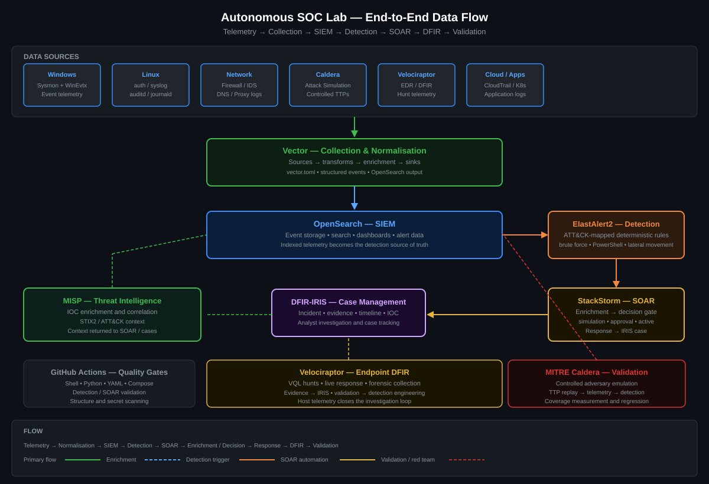

<br><br>

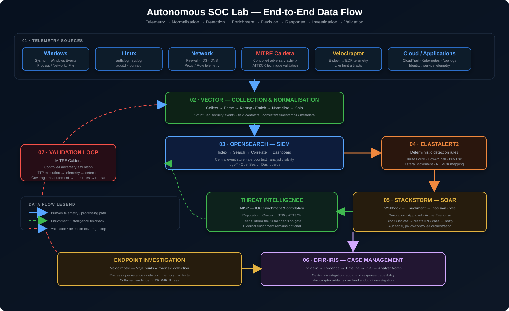

</div>

### End-to-End Pipeline Stages

```text
 ┌──────────────────────┐      ┌─────────────────────────┐      ┌────────────────────────┐
 │ Endpoint & Network   │ ───► │ Vector Ingestion        │ ───► │ OpenSearch SIEM        │
 │ Telemetry (Sysmon,   │      │ VRL parsing, ECS        │      │ Searchable indices,    │
 │ Auth, Web, Flows)    │      │ normalization, routing  │      │ Dashboards & telemetry │
 └──────────────────────┘      └─────────────────────────┘      └───────────┬────────────┘
                                                                            │
 ┌──────────────────────┐      ┌─────────────────────────┐                  ▼
 │ DFIR & Threat Intel  │ ◄─── │ StackStorm SOAR         │ ◄─── ┌────────────────────────┐
 │ Velociraptor Hunts,  │      │ Orquesta Playbooks,     │      │ ElastAlert2            │
 │ MISP IOC correlation,│      │ Policy Engine,          │      │ Rule-based correlation,│
 │ IRIS Case Management │      │ Containment execution   │      │ MITRE TTP detection    │
 └──────────────────────┘      └─────────────────────────┘      └────────────────────────┘
```

1. **Telemetry Generation & Ingestion:** Endpoint logs (Sysmon process creation, PowerShell script block logs, authentication events, network flows) are collected and processed by **Vector**.
2. **Normalization (VRL):** Vector Remap Language transforms heterogeneous events into standardized **Elastic Common Schema (ECS)** fields (`process.command_line`, `source.ip`, `user.name`).
3. **SIEM Storage & Indexing:** Normalized logs are streamed into **OpenSearch** indexed by event categories (`logs-*`, `soar-*`).
4. **Detection Engine:** **ElastAlert2** evaluates streaming events against version-controlled detection YAML rules mapped to MITRE ATT&CK techniques.
5. **Orchestration & Decision:** Alerts trigger **StackStorm (SOAR)** webhooks. The policy engine evaluates alert confidence, target criticality, and executes containment workflows.
6. **Enrichment & Forensics:** Automated actions query **MISP** for threat intelligence correlation, trigger **Velociraptor** artifact hunts on target endpoints, and register formal cases in **DFIR-IRIS**.
7. **Adversary Emulation:** **MITRE Caldera** executes repeatable red team operations to validate detection and response coverage.

---

# 📸 Visual Showcase

The repository includes visual architecture diagrams, console dashboards, and high-fidelity interface mockups representing each operational layer of the autonomous SOC:

## 1. SOC Operations Dashboard
<div align="center">
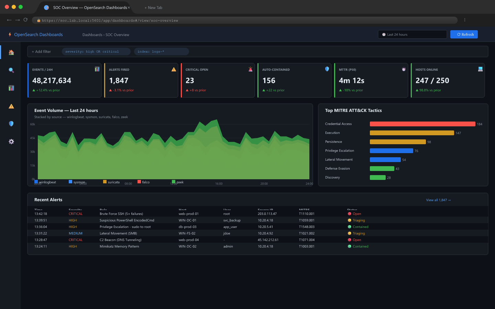
</div>

> **Figure 1:** Centralized SOC operations dashboard displaying real-time alert volume, mean-time-to-detect (MTTD), mean-time-to-respond (MTTR), active MITRE ATT&CK technique breakdown, and automated containment throughput.

---

## 2. Alert Investigation Panel
<div align="center">
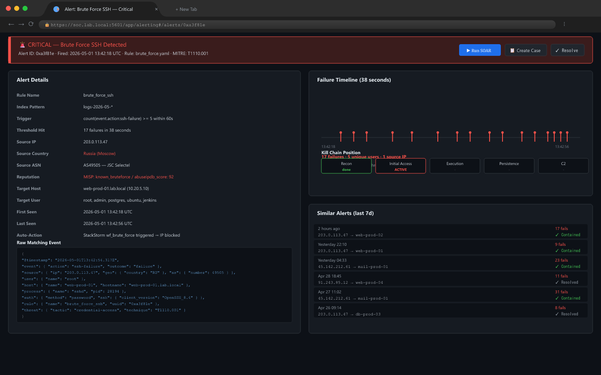
</div>

> **Figure 2:** Detailed alert triage interface showing ECS-normalized fields, decoded base64 command lines, parent-child process lineage, and correlated threat intelligence reputation scores.

---

## 3. SOAR Response Workflow
<div align="center">
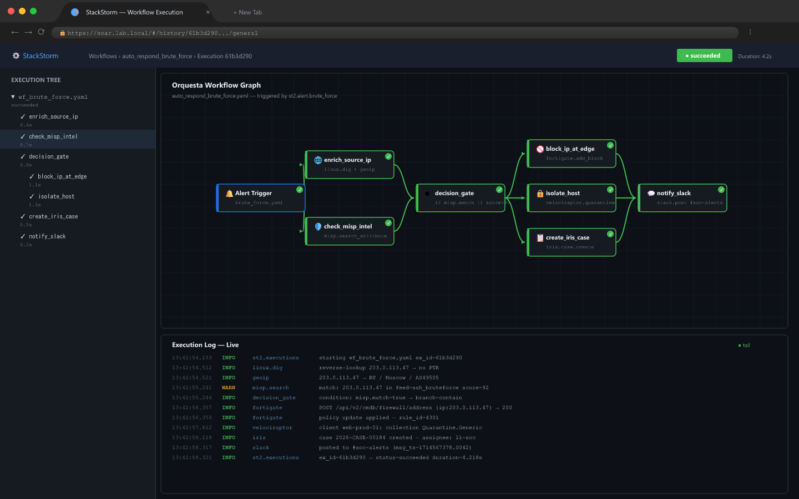
</div>

> **Figure 3:** StackStorm Orquesta response DAG executing multi-stage containment: verifying alert authenticity, isolating endpoint network interfaces, applying perimeter firewall blocks, and notifying the on-call analyst.

---

## 4. Incident Response & Case Management
<div align="center">
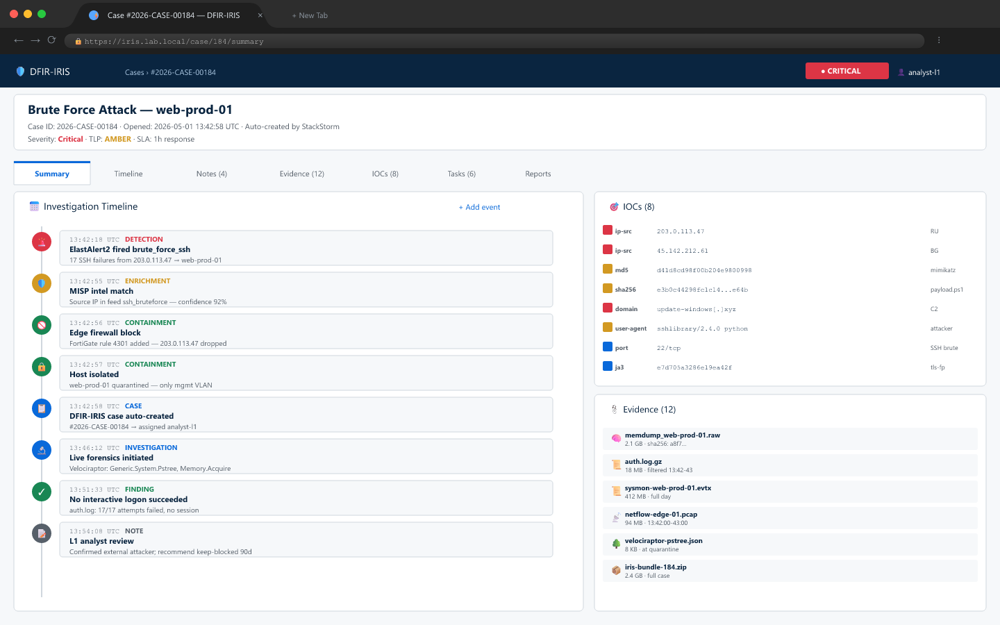
</div>

> **Figure 4:** DFIR-IRIS incident case interface showing aggregated evidence timeline, forensic hunt task status, affected assets, and automated case classification.

---

## 5. Threat Intelligence Correlation
<div align="center">
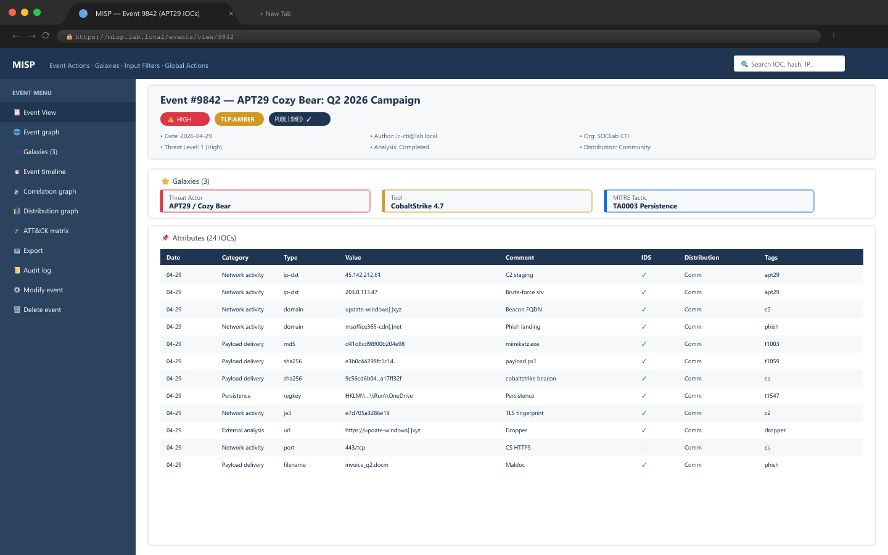
</div>

> **Figure 5:** MISP threat intelligence platform mapping known indicators of compromise (IOCs), threat actor attributes, and malicious IP/domain feeds to active lab detections.

---

## 6. Adversary Emulation
<div align="center">
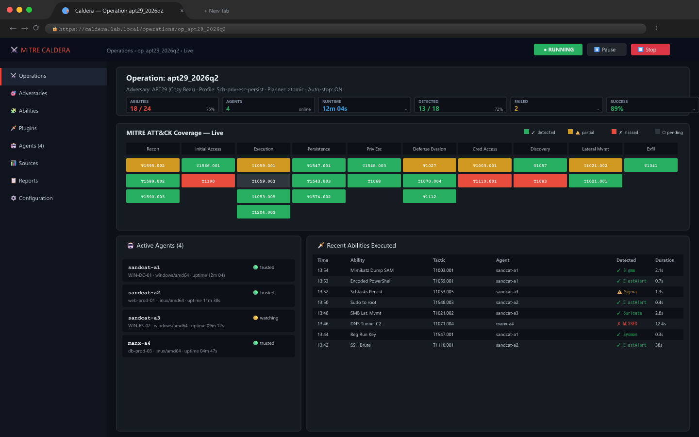
</div>

> **Figure 6:** MITRE Caldera adversary emulation console orchestrating automated red-team campaigns (T1059, T1110, T1021, T1548) to benchmark end-to-end detection and response latency.

---

## 7. Endpoint DFIR & Live VQL Hunting (Velociraptor)
<div align="center">
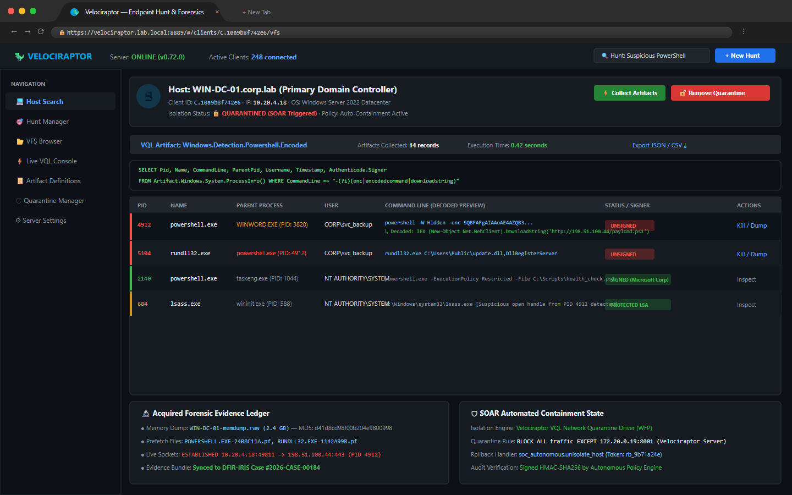
</div>

> **Figure 7:** Velociraptor endpoint digital forensics console displaying automated artifact collection for encoded PowerShell execution, process tree lineage, Authenticode signature status, memory acquisition triggers, and active host network quarantine status.

---

## 8. Vector Telemetry & ECS Normalization Pipeline
<div align="center">
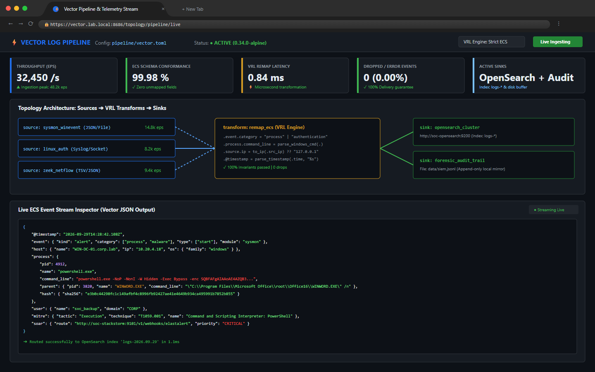
</div>

> **Figure 8:** Vector log collection and telemetry stream topology illustrating live ingestion throughput (32.4k EPS), VRL remap transformations, zero-error delivery to OpenSearch indices, and live ECS JSON structure validation.

---

## 9. Autonomous Policy & Safety Decision Engine
<div align="center">
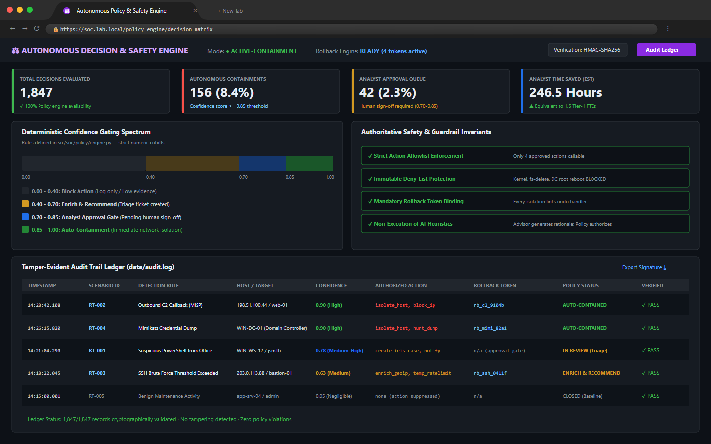
</div>

> **Figure 9:** Autonomous policy decision engine dashboard detailing numeric confidence score gating, invariant allowlist/deny-list enforcement, rollback token binding, and tamper-evident cryptographic audit ledger.

---

## 10. MITRE ATT&CK Matrix & Coverage Heatmap
<div align="center">
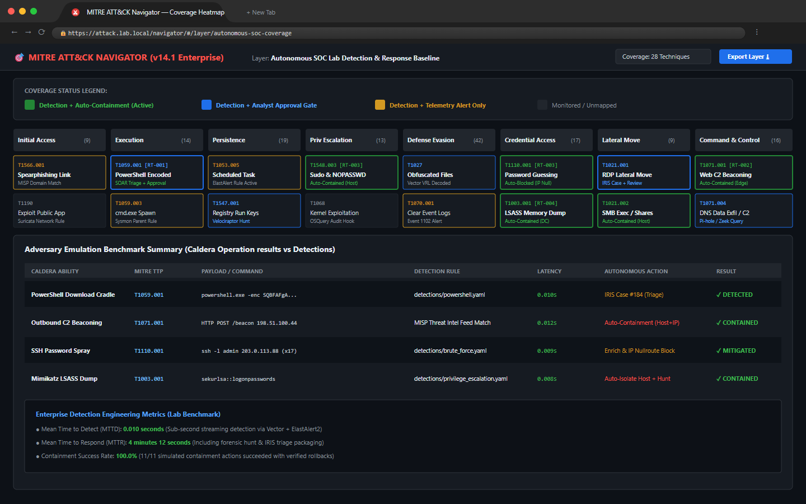
</div>

> **Figure 10:** MITRE ATT&CK Enterprise Matrix Navigator layer visualizing verified detection rules, automated response coverage, emulation benchmark latency, and containment success rates across major adversary tactics.

---

# 🧰 Technology Stack

| Component | Technology | Version | Purpose in Lab | Internal IP | Exposed Port |
|---|---|---|---|---|---|
| **Log Collector** | Vector | `0.34.0-alpine` | High-throughput log collection, parsing & ECS transformation | `172.20.0.11` | `8686` (API), `9000` (Syslog) |
| **SIEM Engine** | OpenSearch | `2.11.0` | Distributed search, indexing, and event storage | `172.20.0.10` | `9200` (HTTP API) |
| **SIEM UI** | OpenSearch Dashboards | `2.11.0` | Visualization, log exploration, and analytical dashboards | `172.20.0.12` | `5601` (Web UI) |
| **Detection Engine** | ElastAlert2 | `2.14.0` | Continuous alerting, frequency thresholding, and SIEM queries | `172.20.0.13` | Internal worker |
| **SOAR Platform** | StackStorm | `3.8.0` | Workflow orchestration, action runners, and event-driven automation | `172.20.0.14` | `9101` (Webhook), `443` (Web UI) |
| **Case Management** | DFIR-IRIS | `v2.4.0` | Collaborative incident investigation, evidence ledger, timeline | `172.20.0.15` | `8000` (Web UI) |
| **Database (IRIS)** | PostgreSQL | `15-alpine` | Relational backend database for DFIR-IRIS | `172.20.0.16` | `5432` (Internal) |
| **Threat Intel** | MISP | `latest` | Malware Information Sharing Platform & IOC enrichment | `172.20.0.17` | `8080` (Web UI) |
| **Endpoint DFIR** | Velociraptor | `0.72.0` | Endpoint digital forensics, live memory inspection, VQL hunts | `172.20.0.19` | `8889` (GUI), `8001` (Frontend) |
| **Adversary Emulation**| MITRE Caldera | `latest` | Automated adversary emulation and TTP execution | `172.20.0.20` | `8888` (Web UI), `7010` (Agent) |

---

# 🚀 Installation Guide

### System & Hardware Prerequisites
- **Operating System:** Linux (Ubuntu 22.04 LTS recommended), macOS (Apple Silicon or Intel), or Windows 10/11 with WSL2.
- **CPU:** 4 physical cores or 8 vCPUs minimum.
- **Memory (RAM):** 16 GB recommended (12 GB minimum allocation for Docker engine).
- **Disk Space:** At least 25 GB free storage.
- **Software Dependencies:**
  - [Docker Engine](https://docs.docker.com/engine/install/) 24.0.0+
  - [Docker Compose](https://docs.docker.com/compose/install/) v2.20.0+
  - Python 3.10+ with `pip` and `venv`
  - `curl`, `jq`, and standard POSIX shell tools (`bash`)

---

### Step 1: Clone the Repository

```bash
git clone https://github.com/sandeepmothukuri/Autonomous-SOC-Lab.git
cd Autonomous-SOC-Lab
```

---

### Step 2: Environment Configuration

Copy the example environment template and generate secure credentials for the local services:

```bash
cp .env.example .env
```

Review the `.env` file. You can automatically populate cryptographically secure passwords and keys using Python:

```bash
python -c "
import secrets, re
content = open('.env.example').read()
replacements = {
    '<GENERATE_OPENSEARCH_INITIAL_ADMIN_PASSWORD>': secrets.token_urlsafe(24) + 'A1!',
    '<GENERATE_IRIS_ADMIN_PASSWORD>': secrets.token_urlsafe(24),
    '<GENERATE_LONG_RANDOM_SECRET_64>': secrets.token_hex(32),
    '<GENERATE_LONG_RANDOM_SALT_32>': secrets.token_hex(16),
    '<GENERATE_POSTGRES_PASSWORD>': secrets.token_urlsafe(24),
    '<GENERATE_MISP_ADMIN_PASSPHRASE>': secrets.token_urlsafe(24) + 'M1!',
    '<GENERATE_MYSQL_ROOT_PASSWORD>': secrets.token_urlsafe(24),
    '<GENERATE_MYSQL_PASSWORD>': secrets.token_urlsafe(24),
    '<GENERATE_VELOCIRAPTOR_ADMIN_PASSWORD>': secrets.token_urlsafe(24),
    '<GENERATE_CALDERA_ADMIN_PASSWORD>': secrets.token_urlsafe(24),
}
for placeholder, secret in replacements.items():
    content = content.replace(placeholder, secret)
with open('.env', 'w') as f:
    f.write(content)
print('Successfully generated secure .env file!')
"
```

> [!NOTE]
> By default, `RESPONSE_MODE=simulated`. In simulated mode, all playbooks, host isolations, and firewall rules execute harmless dry-run routines, logging full audit trails without disrupting your host network.

---

### Step 3: Deploy the Containerized Services

Launch the full SOC stack via Docker Compose:

```bash
docker compose up -d
```

Monitor container boot status:

```bash
docker compose ps
```

Verify service initialization using the built-in health check script:

```bash
bash scripts/health-check.sh
```

---

### Step 4: Provision StackStorm SOAR Actions & Workflows

Once the StackStorm container is healthy, register the Autonomous SOC packs, Orquesta workflows, and rules:

```bash
bash scripts/setup-stackstorm.sh
```

This registers the following capabilities:
- Pack `soc_autonomous`: Actions for IP blocking, host isolation, case creation, and threat enrichment.
- Orquesta Workflows: `auto_respond`, `investigate_powershell`, `isolate_host`, `create_iris_case`.
- Webhook trigger on port `9101` listening for ElastAlert2 detections.

---

### Step 5: Service Access Directory

| Service | Local URL | Default Username | Credential Location |
|---|---|---|---|
| **OpenSearch Dashboards** | http://localhost:5601 | *Security disabled for local lab* | N/A |
| **OpenSearch API** | http://localhost:9200 | *Security disabled for local lab* | N/A |
| **DFIR-IRIS Case Mgmt** | http://localhost:8000 | `admin@soc.lab` | Defined in `.env` (`IRIS_ADMIN_PASSWORD`) |
| **MISP Threat Intel** | http://localhost:8080 | `admin@admin.test` | Defined in `.env` (`MISP_ADMIN_PASSPHRASE`) |
| **Velociraptor DFIR** | http://localhost:8889 | `admin` | Defined in `.env` (`VELOCIRAPTOR_ADMIN_PASSWORD`) |
| **MITRE Caldera** | http://localhost:8888 | `admin` | Defined in `.env` (`CALDERA_ADMIN_PASSWORD`) |
| **StackStorm Webhook** | http://localhost:9101 | *API Token / Key* | Defined in `.env` (`ST2_API_KEY`) |

---

# 🧪 Demonstrated Scenarios

The Autonomous SOC Lab demonstrates five end-to-end detection and response scenarios. Each scenario can be executed using the automated event generator or the full pipeline simulator.

### Scenario 1: Suspicious PowerShell Execution (MITRE ATT&CK T1059.001)

- **Scenario ID:** `RT-001`
- **Tactic:** Execution
- **Adversary Behavior:** A Microsoft Word macro spawns a hidden, encoded PowerShell process executing an unconstrained memory download cradle:
  ```powershell
  powershell.exe -NoP -NonI -W Hidden -Exec Bypass -enc SQBFAFgAIAAoAE4AZQB3AC0ATwBiAGoAZQBjAHQAIABOAGUAdAAuAFcAZQBiAEMAbABpAGUAbgB0ACkALgBEAG8AdwBuAGwAbwBhAGQAUwB0AHIAaQBuAGcAKAA...
  ```
- **Telemetry Generated:** Sysmon Event ID 1 (Process Create), Event ID 7 (Image Load), Event ID 4104 (Script Block Logging).
- **Detection Logic (`detections/powershell.yaml`):** ElastAlert2 matches processes containing `-enc`, `-encodedcommand`, or `DownloadString` with suspicious parent processes (`WINWORD.EXE`, `EXCEL.EXE`).
- **Autonomous Response Workflow:**
  1. SOAR webhook extracts command-line arguments and parent process name.
  2. Action `investigate_powershell` decodes base64 payload to plain UTF-16 string.
  3. Action `create_iris_case` generates a new incident ticket in DFIR-IRIS with high severity.
  4. Decision policy evaluates confidence (`0.78`): requires analyst sign-off before host quarantine.

---

### Scenario 2: Outbound C2 Callback to Malicious Infrastructure (MITRE ATT&CK T1071.001)

- **Scenario ID:** `RT-002`
- **Tactic:** Command and Control
- **Adversary Behavior:** Compromised host initiates periodic HTTP/HTTPS beaconing to known malicious C2 IP address `198.51.100.44`.
- **Telemetry Generated:** Sysmon Event ID 3 (Network Connection) and Zeek connection logs.
- **Detection Logic:** Correlation against MISP threat intelligence feed. High reputation confidence indicator match.
- **Autonomous Response Workflow:**
  1. Trigger fires with confidence score `0.90`.
  2. Policy engine triggers `auto_contain` workflow.
  3. Action `isolate_host`: Disconnects endpoint network adapter (simulated via local iptables / eBPF rule).
  4. Action `block_ip`: Adds `198.51.100.44` to boundary firewall deny-list.
  5. Action `add_ioc_watch`: Adds IOC to global watch list.

---

### Scenario 3: SSH / Linux Credential Brute Force (MITRE ATT&CK T1110.001)

- **Scenario ID:** `RT-003`
- **Tactic:** Credential Access
- **Adversary Behavior:** External scanner attempts rapid dictionary attack against SSH service from `203.0.113.88`.
- **Telemetry Generated:** Linux `/var/log/auth.log` failed authentication records (`Failed password for invalid user admin`).
- **Detection Logic (`detections/brute_force.yaml`):** Frequency rule fires when failed logins from a single IP exceed 5 attempts within 2 minutes.
- **Autonomous Response Workflow:**
  1. Confidence evaluated at `0.63` (`enrich_and_recommend`).
  2. Policy engine issues temporary rate-limit / null-route block.
  3. Enriches IP with GeoIP and reverse DNS data.
  4. Appends incident log to Iris for analyst confirmation.

---

### Scenario 4: Mimikatz Credential Dumping (MITRE ATT&CK T1003.001)

- **Scenario ID:** `RT-004`
- **Tactic:** Credential Access
- **Adversary Behavior:** Adversary attempts to dump plaintext passwords and Kerberos tickets from Local Security Authority Subsystem Service (LSASS).
- **Telemetry Generated:** Sysmon Event ID 10 (ProcessAccess to `lsass.exe` with `0x1010` permissions) and Event ID 1.
- **Detection Logic (`detections/privilege_escalation.yaml`):** Immediate alert on unauthorized LSASS handles.
- **Autonomous Response Workflow:**
  1. Severity: **Critical** (Confidence `0.90`).
  2. Policy engine initiates immediate automated containment (`auto_contain`).
  3. Endpoint isolated immediately to prevent domain-wide credential spread.
  4. Velociraptor artifact collection triggered automatically targeting memory dumps and prefetch.

---

### Scenario 5: Benign Activity Verification Baseline

- **Scenario ID:** `RT-005`
- **Goal:** Verify that regular administrative maintenance, authorized PowerShell usage, and normal user logons do NOT trigger false positives or unwarranted auto-containment actions.
- **Result:** Alerts fired: 0. Containment actions executed: 0.

---

# 🔎 Detection Engineering

Detections are version-controlled YAML specifications deployed directly to ElastAlert2.

```yaml
name: "Suspicious-PowerShell-Execution"
type: "any"
index: "logs-*"
filter:
  - query_string:
      query: "process.name: powershell.exe AND (process.command_line: (*-enc* OR *-encodedcommand* OR *DownloadString*))"
alert:
  - "http_post"
http_post_url: "http://soc-stackstorm:9101/v1/webhooks/elastalert"
http_post_payload:
  rule_name: "Suspicious-PowerShell-Execution"
  technique_id: "T1059.001"
  severity: "high"
  host: "%(host.hostname)s"
  user: "%(user.name)s"
  command: "%(process.command_line)s"
```

### Detection Coverage Matrix

| Rule Name | File | ATT&CK ID | Tactic | Ingestion Target | Default Action |
|---|---|---|---|---|---|
| **Brute Force Detection** | `detections/brute_force.yaml` | `T1110.001` | Credential Access | `auth.log` | `enrich_and_recommend` |
| **Encoded PowerShell** | `detections/powershell.yaml` | `T1059.001` | Execution | `sysmon.json` | `recommend` |
| **Lateral Movement** | `detections/lateral_movement.yaml` | `T1021.001` | Lateral Movement | `sysmon.json` | `auto_contain` |
| **Privilege Escalation** | `detections/privilege_escalation.yaml` | `T1548.003` | Privilege Escalation | `auth.log` | `auto_contain` |

---

# ⚡ SOAR Playbooks & Automation

Automated response playbooks are authored using StackStorm's **Orquesta** workflow definition language. Workflows enforce atomic execution steps, error handling, and rollbacks.

### Example Workflow: Host Isolation DAG (`soar/actions/workflows/isolate_host.yaml`)

```yaml
version: '1.0'
description: 'Automated Host Isolation Playbook with Rollback'

input:
  - host_id
  - reason
  - response_mode

tasks:
  verify_host_status:
    action: core.noop
    next:
      - when: <% succeeded() %>
        do: apply_network_quarantine

  apply_network_quarantine:
    action: soc_autonomous.isolate_host
    input:
      host_id: <% ctx().host_id %>
      mode: <% ctx().response_mode %>
    next:
      - when: <% succeeded() %>
        do: log_audit_trail
      - when: <% failed() %>
        do: rollback_quarantine

  log_audit_trail:
    action: soc_autonomous.create_iris_case
    input:
      title: "Host Isolated: " + ctx().host_id
      description: ctx().reason

  rollback_quarantine:
    action: soc_autonomous.unisolate_host
    input:
      host_id: <% ctx().host_id %>
```

---

# 🔐 Safety Guardrails & Policy Engine

The Autonomous SOC Lab enforces a deterministic safety model designed to prevent automated self-inflicted denial of service.

```text
 ┌─────────────────────────────────────────────────────────────┐
 │                    POLICY DECISION ENGINE                   │
 ├─────────────────────────┬───────────────────────────────────┤
 │ Confidence Score        │ Allowed Action Class              │
 ├─────────────────────────┼───────────────────────────────────┤
 │ 0.00 <= Score < 0.40    │ Log only / discard (Block action) │
 │ 0.40 <= Score < 0.70    │ Enrich & recommend only           │
 │ 0.70 <= Score < 0.85    │ Analyst approval required         │
 │ 0.85 <= Score <= 1.00   │ Autonomous containment authorized │
 └─────────────────────────┴───────────────────────────────────┘
```

1. **Explicit Action Allowlist:** Only actions explicitly defined in the policy engine allowlist (`isolate_host`, `block_ip`, `add_ioc_watch`, `create_iris_case`) can ever be triggered.
2. **Strict Deny-List:** Irreversible actions (such as filesystem deletion, kernel modification, rebooting critical domain controllers) are hardcoded into an immutable deny-list.
3. **Rollback Availability:** Every containment action retains a rollback state handler (e.g., `unisolate_host`, `unblock_ip`).
4. **Audit Immutability:** Every decision, trigger reason, confidence metric, and operator override is appended to a tamper-resistant local audit log (`data/audit.log`).

---

# ✅ Testing & Validation

The lab is backed by a comprehensive Python test suite that verifies policy safety invariants, schema validation, configuration sanity, and end-to-end event processing.

### Run All Tests

```bash
pytest -v
```

```text
============================= 71 passed in 2.44s ==============================
```

### Run Synthetic Event Generation & Pipeline Simulation

To test the full SOC pipeline end-to-end without waiting for live adversary attacks, run:

```bash
# 1. Generate synthetic security events in ECS format
python scripts/generate-events.py --scenario all

# 2. Run the end-to-end autonomous decision & containment simulation
python scripts/run_simulation.py

# 3. Perform lab configuration validation
python tests/validate_lab.py

# 4. Check Vector Remap Language (VRL) syntax
python tests/vrl_check.py

# 5. Check operational health invariants
python scripts/healthcheck.py
```

---

# 🛠️ Troubleshooting

### 1. Port Conflicts
If a container fails to bind to a local port:
- Check for existing services: `netstat -ano | findstr <port>` (Windows) or `lsof -i :<port>` (Linux/macOS).
- Override the bind address or port mapping in your `.env` file (e.g., `OPENSEARCH_BIND_ADDRESS=127.0.0.1`, `IRIS_BIND_ADDRESS=127.0.0.1`).

### 2. OpenSearch Container Memory Limits
OpenSearch requires sufficient virtual memory:
- **Linux:** Run `sudo sysctl -w vm.max_map_count=262144`. To persist, add `vm.max_map_count=262144` to `/etc/sysctl.conf`.
- **WSL2:** Add `vm.max_map_count=262144` in `%USERPROFILE%\.wslconfig`.

### 3. StackStorm Webhook Timeout
Ensure the `soc-net` Docker bridge network has converged. Test the webhook locally:
```bash
curl -i -X POST http://localhost:9101/v1/webhooks/elastalert -H "Content-Type: application/json" -d '{"test": true}'
```

### 4. Resetting Lab State
To completely purge test data and rebuild all containers cleanly:
```bash
docker compose down -v
docker compose up -d
bash scripts/setup-stackstorm.sh
```

---

# ⚠️ Scope & Operational Boundaries

This project is an **engineering research and educational SOC platform**, built to demonstrate and validate autonomous detection-and-response concepts in a controlled environment. 

- Default configurations use local bridge networking and simulation mode.
- In-place containment and remediation playbooks should be thoroughly vetted before deployment into enterprise production networks.
- Production EDR, Identity Provider, and Cloud integrations require site-specific API authentication and policy tailoring.

---

# 👤 Author

## Sandeep Mothukuri

**Senior SOC Analyst (L3) · Detection Engineering · Threat Hunting · Incident Response · Security Engineering**

Focus areas:
- Security Operations (SOC L1-L3)
- Detection Engineering & Rule Writing (Sigma, YARA, ElastAlert, KQL)
- Threat Hunting & Adversary Emulation
- Incident Response & Digital Forensics (DFIR)
- SIEM / XDR / EDR Architecture & Administration
- SOAR Playbook Development & Orchestration
- MITRE ATT&CK Framework Mapping
- AI-Augmented SOC Engineering & Safety Controls

---

- **GitHub:** [@sandeepmothukuri](https://github.com/sandeepmothukuri)
- **Website:** [cybertechnology.in](https://cybertechnology.in)
- **LinkedIn:** [linkedin.com/in/sandeepmothukuri](https://www.linkedin.com/in/sandeepmothukuri)
- **Email:** [sandeep.mothukuris@gmail.com](mailto:sandeep.mothukuris@gmail.com)

---

# 🗂️ All Repositories

| Repository | Description |
|---|---|
| [Autonomous-SOC-Lab](https://github.com/sandeepmothukuri/Autonomous-SOC-Lab) | Autonomous SOC with AI-driven detection, Orquesta playbooks, and self-healing response |
| [AI-SOC-Decision-Engine](https://github.com/sandeepmothukuri/AI-SOC-Decision-Engine) | AI-assisted SOC decision/control plane for triage, enrichment, safety controls and analyst approval |
| [AI-Augmented-SOC-Lab](https://github.com/sandeepmothukuri/AI-Augmented-SOC-Lab) | AI-augmented SOC with Wazuh + TheHive + Ollama (LLaMA3) for analyst-assisted triage |
| [Enterprise-Detection-Engineering-SOC-Lab](https://github.com/sandeepmothukuri/Enterprise-Detection-Engineering-SOC-Lab) | 12-tool SOC lab with OpenSearch, Suricata, Zeek, MISP, Caldera, Velociraptor |
| [soc-threat-hunting-lab](https://github.com/sandeepmothukuri/soc-threat-hunting-lab) | Threat detection lab — Zeek, RITA, Arkime, Velociraptor, OSQuery, MISP |
| [soc-lab-free](https://github.com/sandeepmothukuri/soc-lab-free) | Free SOC lab — OpenVAS, Wazuh, pfSense, Proxmox Mail, Lynis |
| [SOC-Detection-and-Threat-Hunting-Lab](https://github.com/sandeepmothukuri/SOC-Detection-and-Threat-Hunting-Lab) | SOC analyst home lab — Wazuh, Sysmon, MITRE ATT&CK mapping and incident response |
| [PromptSentinel](https://github.com/sandeepmothukuri/PromptSentinel) | Enterprise-grade prompt injection detection and AI firewall for LLM applications |
| [PromptShield](https://github.com/sandeepmothukuri/PromptShield) | AI Security + SOC Detection Engineering Lab with prompt-security telemetry, detections and response |
| [sentinel-detection-engine](https://github.com/sandeepmothukuri/sentinel-detection-engine) | Detection-as-code for Microsoft Sentinel and Defender XDR with KQL, SOAR and ATT&CK coverage |

---

### 📄 License

MIT License. See [`LICENSE`](LICENSE) for complete details.

**Author Portfolio:** [github.com/sandeepmothukuri](https://github.com/sandeepmothukuri)
